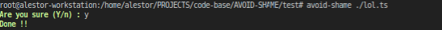

<h1 align=center>AVOID-SHAME</h1>

> This is a simple code for avoiding console shaming

<p align=center>

<a href="https://github.com/alestor123/AVOID-SHAME/issues">
</a>

<a href="https://www.npmjs.com/package/avoid-shame"></a>
</p>
<p align=center>
<a href="https://npmjs.org/package/avoid-shame">
</a>
</p>

## 🚀 Usage

## API

```
const aviodShame = require('./App')
aviodShame(['./test/lol.ts']) 
```

## Quick use
```
$ npx avoid-shame <input file or directory paths>
```
## CLI Installation
```
$ npm install -g avoid-shame
```
```
$ avoid-shame <input file or directory paths>
```
# Screenshots    




## 💖 [Donate](https://alestor123.is-a.dev/donate)


## Author

👤 **Alestor Aldous**

- Twitter: [@alestor123](https://twitter.com/alestor123)
- Github: [@alestor123](https://github.com/alestor123)


## 📝 License
> MIT

Copyright © 2022 [Alestor Aldous](https://github.com/alestor123).<br />